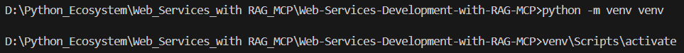
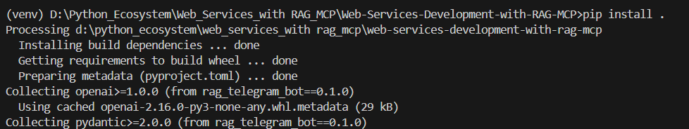
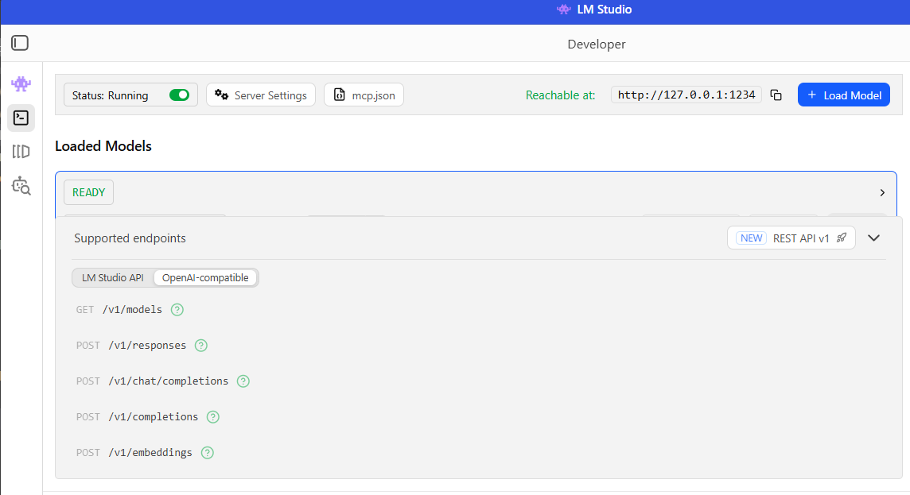
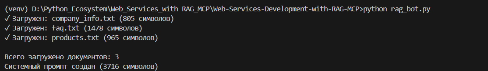
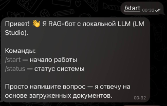
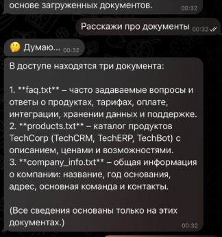

# RAG Telegram Bot с LM Studio

Telegram-бот с поддержкой RAG (Retrieval-Augmented Generation), использующий LM Studio для локального запуска LLM.

---

## Что нужно для создания RAG-бота?

Для создания бота нужны три вещи:

1. **LLM (языковая модель)** — "мозг" бота, который понимает вопросы и генерирует ответы
2. **Документы** — файлы с информацией, по которой бот будет отвечать
3. **Интерфейс** — способ общения с ботом (Telegram, веб-сайт и т.д.)

### Как это работает?

Отправьте /start → бот должен прислать приветствие.

Отправьте /status → бот покажет статус LM Studio и количество загруженных документов.

Отправьте вопрос по содержимому документов → бот вернёт ответ на основе контекста.

## Установка и настройка 

### Создание и активация виртуального окружения



### Установка зависимостей 



#### Telegram Bot Token

1. Найти @BotFather в Telegram
2. Выполнить команду `/newbot`
3. Следовать инструкциям
4. Скопировать полученный токен

### Создать файл .env и заполнить конфигурацию:

```env
TELEGRAM_BOT_TOKEN=ваш_токен_от_BotFather
LM_STUDIO_URL=http://localhost:1234/v1
```
### Установить и настроить локальный сервер LM Studio



### Запуск бота



## Демонстрация работы


